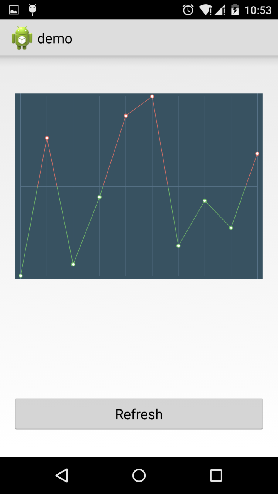

TrendDrawable
=============
An android trend drawable. _Usually for stock/fund profit trend etc._

#### How to use

1. Put an `ImageView` in xml or create it by code

2. Create a `TrendDrawable` instance

3. `ImageView.setImageDrawable(trendDrawable)`

4. If you'd like an animation, call `startAnimation()`

#### Options

In step2 above, after a `TrendDrawable` instance created, you can set a few options(color/size):

`TrendDrawable.setColors()`, see `TrendDrawable.Colors` class for details.

`TrendDrawable.setSizes()`, see `TrendDrawable.Sizes` class for details.

_This drawable's animation requires android 3.0(api 11) and later, if you want to use on earlier versions, add [NineOldAndroids](https://github.com/JakeWharton/NineOldAndroids) library as dependency and replace the following imports:_

`android.animation.Animator --> com.nineoldandroids.animation.Animator`

`android.animation.ObjectAnimator --> com.nineoldandroids.animation.ObjectAnimator`
